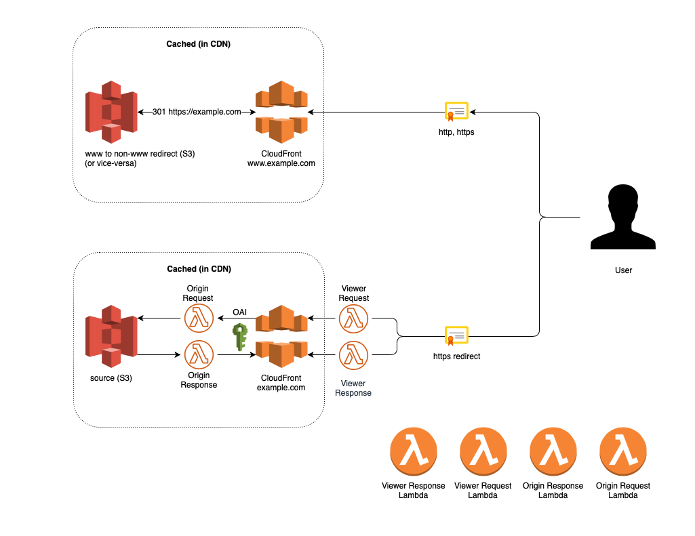

Terraform template - Static Site Hosting
========================================




Architecture
============

For the static data we use an S3 bucket. The S3 bucket is an "origin" for CloudFront distribution that allows us to play with caching, DNS, security etc.

To provide functionality that is normally present on web servers like `nginx` or `apache2` we suplement the CloudFront distribution with multiple additions through S3 Website hosting and Lambda@Edge.

Redirects
=========

For permanently redirecting a site we use separate S3+CloudFront distribution. 

We use the native S3 website hosting and `redirect_all_requests_to` parameter in the `website` block as seen in the example below.

```
locals {
  bucket_name_x = "${var.project}-${var.name}-www-redirect-${var.stage}"
}

resource "aws_s3_bucket" "x" {
  bucket = "${lower(local.bucket_name_x)}"
  acl    = "private"

  website {
    redirect_all_requests_to = "https://${var.default_domain}"
  }

  tags {
    Name    = "${lower(local.bucket_name_x)}"
    Project = "${var.proj-tag}"
    Stage   = "${var.stage}"
    App     = "www-redirect"
  }
}
```

In the CloudFront resource we use the actual `S3 website URL` as the origin, instead of `S3 Origin` (see `domain_name` directive in the origin block in the code example below). More about `S3 Origin` is written later in this documentation. This means that CloudFront is not fetching the objects directly from S3 but instead from the S3 hosted site.

(S3 hosted site is a site that has a specific URL http://bucket_name.s3-website.aws_region.amazonaws.com and has a limited settings in the S3 bucket options - more info in the official docs: https://docs.aws.amazon.com/AmazonS3/latest/dev/WebsiteHosting.html) We use it only for redirecting.

```
resource "aws_cloudfront_distribution" "s3_distribution__www-redirect" {
  provider = "aws.us"

  origin {
    domain_name = "${local.bucket_name_x}.s3-website.${var.aws_region}.amazonaws.com"
    origin_id   = "${local.s3_origin_id__www-redirect}"

    custom_origin_config {
      http_port              = 80
      https_port             = 443
      origin_protocol_policy = "http-only"
      origin_ssl_protocols   = ["SSLv3", "TLSv1", "TLSv1.1", "TLSv1.2"]
    }
  }

  ...
```
TTL is set to a long time as we want to cache the requests as much as we can to not use the slow S3 hosting and instead host everything from CDN (see `ttl` directives in the `default_cache_behavior` block in the code example below).
  
We also set the `viewer_protocol_policy` to `"allow-all"` which allows both http and https connections to be redirected.

The `aliases` directive defines which DNS records we can point to the CloudFront distribution. It's not possible to point DNS records to a CloudFront distribution without stating them in the `aliases` list. We use the `www.*` here because we want to redirect www to non-www urls. (eg. http://www.example.com/xyz -> https://example.com/xyz, https://www.example.com/xyz -> https://example.com/xyz) and cache the 301s in CloudFront.

```
  ...

  aliases = ["www.${var.default_domain}"]

  restrictions {
    geo_restriction {
      restriction_type = "none"
    }
  }

  default_cache_behavior {
    allowed_methods  = ["GET", "HEAD"]
    cached_methods   = ["GET", "HEAD"]
    target_origin_id = "${local.s3_origin_id__www-redirect}"
    compress         = true

    min_ttl     = 31536000
    max_ttl     = 31536000
    default_ttl = 31536000

    forwarded_values {
      query_string = false

      cookies {
        forward = "none"
      }
    }

    viewer_protocol_policy = "allow-all"
  }
  
  ...

}
``` 

S3 Origin
=========

CloudFront supports multiple origin types (https://docs.aws.amazon.com/AmazonCloudFront/latest/DeveloperGuide/DownloadDistS3AndCustomOrigins.html). 

In the www-redirect part we used custom origin. Now we need to expose the actual site's static files and we use S3 Origin for that.

The S3 Origin has a great functionality called OAI (Origin Access Identity) - it allows CloudFront to access the files as we want the files to be accessed only through CloudFront. Any other access is implicitly denied. We create the `aws_cloudfront_origin_access_identity` resource and grant access through `aws_s3_bucket_policy`. 

```
resource "aws_cloudfront_origin_access_identity" "origin_access_identity" {
  provider = "aws.us"
  comment  = "CloudFront Origin Access"
}

data "aws_iam_policy_document" "s3_policy_b" {
  statement {
    actions   = ["s3:GetObject"]
    resources = ["${aws_s3_bucket.b.arn}/*"]

    principals {
      type        = "AWS"
      identifiers = ["${aws_cloudfront_origin_access_identity.origin_access_identity.iam_arn}"]
    }
  }

  statement {
    actions   = ["s3:ListBucket"]
    resources = ["${aws_s3_bucket.b.arn}"]

    principals {
      type        = "AWS"
      identifiers = ["${aws_cloudfront_origin_access_identity.origin_access_identity.iam_arn}"]
    }
  }
}

resource "aws_s3_bucket_policy" "origin-access-admin" {
  bucket = "${aws_s3_bucket.b.id}"
  policy = "${data.aws_iam_policy_document.s3_policy_b.json}"
}
```

Lambda@Edge
===========


This service enables to execute code in four different stages.

* When the user requests something from the CloudFront client facing URL (Viewer Request)
	* This Lambda is executed every time (no caching)
	* We use basic_auth Lambda here for development

* When the CloudFront requests the file from the origin (Origin Request)
	* The request can be altered in some way
	* We use the try_files Lambda here
		* If the request is for example `https://URL/folder/` -> Lambda looks into the S3 bucket and searches for `https://URL/folder/index.html` and adjusts the request accordingly. 
	* When the according response is not in the CloudFront cache the Lambda is executed
	* Next time the CloudFront returns the data immediately and does it from cache

* When the Origin returns data back to CloudFront (Origin Response)
	* You can modify the response here 
	* We use the trailing_slash Lambda here
		* It adjusts the response (request: https://URL/section_xyz/ -> 301 https://URL/section_xyz)
	* Next time CloudFront already knows that this url is a 301 and doesn't execute the Lambda

* When the CloudFront returns data back to the browser
	* We don't use it
	* Not cached - executed every time

Lambda@Edge is only available in the region `us-east-1` - that's why we use two AWS providers in the terraform config. CloudFront, Lambdas and ACM Certificates need to be provisioned in `us-east-1`. S3 buckets can be in eu-central-1 - for faster access from Europe (maybe for compliance reasons? anyway the data is in CDN so it's saved on multiple locations around the world)

List of resources deployed to the default region:

* aws_s3_bucket - www-redirect
* aws_s3_bucket - main-bucket
* aws_s3_bucket_policy for main-bucket
* aws_iam_user - for CircleCI


List of resources deployed to us-east-1 region:

* aws_cloudfront_origin_access_identity
* aws_cloudfront_distribution - main
* aws_cloudfront_distribution - www-redirect
* aws_lambda_function - all Lambdas
* aws_acm_certificate - TODO (currently a valid manually created certificate in ACM is expected to be present - one certificate with www and non-www domain aliases - it's retrieved in the code example below)


```
data "aws_acm_certificate" "main_cert" {
  provider = "aws.us"
  domain   = "${var.default_domain}"

  statuses = [
    "ISSUED",
  ]
}

...

resource "aws_cloudfront_distribution" "s3_distribution__admin" {

  ...

  viewer_certificate {
    acm_certificate_arn = "${data.aws_acm_certificate.main_cert.arn}"
    ssl_support_method  = "sni-only"
  }

  ...
}

```

NOTE: Lambda@Edge can't use environment variables - therefore everything needs to be hardcoded in the Lambda code.

Lambdas implemented:

* try_files
	* Simulates the try_files directive as used in nginx configuration. 
	* See the index.js in the `example/lambda-try-files`

* trailing_slash
	* strips off the last trailing slash to have consistent urls
	* returns 301s on the incorrect urls and caches them in CloudFront

* basic_auth
	* adds basic auth
	* the user and password is set in the index.js in `example/lambda-basic-auth`
	* useful for development sites
	* not cached in CDN - executed every time


CI/CD
=====

See `example/circleci-config.yml` 

Steps:

* Upload new versions of the static files to S3
* Using cache-headers adjust the browser cache 
	* (eg. JavaScript files with generated names can be cached in the browser for 1 year to increase the loading times)
	* set it with AWS-CLI as in `aws s3 cp --recursive --cache-control max-age=2592000 build/static s3://${!S3_BUCKET}/static`
* Invalidate the CloudFront cache to load new files from S3


Testing
=======

There is a lot of useful info in the response headers from CloudFront. See the docs to understand how to use that info.

```
$ curl -I https://admin.dev.carvago.utdigit.com/car-detail/119973

HTTP/1.1 401 Unauthorized
Content-Length: 12
Connection: keep-alive
Server: CloudFront
Date: Mon, 19 Aug 2019 14:03:34 GMT
WWW-Authenticate: Basic
X-Cache: LambdaGeneratedResponse from cloudfront
Via: 1.1 472d4cc0196b47296b184116698506c2.cloudfront.net (CloudFront)
X-Amz-Cf-Pop: PRG50
X-Amz-Cf-Id: ErBax5417C_eI5vdOk6h384wAGWb4VPsg1r-9O_qe2EoeGER8BwR-g==

$ curl -I -u carvago:usertech2019  https://admin.dev.carvago.utdigit.com/car-detail/119973

HTTP/1.1 200 OK
Content-Type: text/html
Content-Length: 2112
Connection: keep-alive
Date: Mon, 19 Aug 2019 14:04:17 GMT
Last-Modified: Mon, 19 Aug 2019 12:15:41 GMT
ETag: "0906bd44794000627d9fba7ca099dbe3"
Accept-Ranges: bytes
Server: AmazonS3
Vary: Accept-Encoding
X-Cache: Error from cloudfront
Via: 1.1 e0c589730c9a4b532776db9306e169c9.cloudfront.net (CloudFront)
X-Amz-Cf-Pop: PRG50
X-Amz-Cf-Id: QkEq50RSc_ElfIqqGOP0Z0eHCVhSlTAwqmfYR1iDJWIAO0O_oWyDtg==

$ curl -I -u carvago:usertech2019  https://admin.dev.carvago.utdigit.com/

HTTP/1.1 200 OK
Content-Type: text/html
Content-Length: 2112
Connection: keep-alive
x-amz-id-2: N2k8DhuAub4R/BP+XZfP0nuynZjPpIy8+V7hbBvkgOOsyD6bWN5So4cOniOUlmHMKWJxHbQjInk=
x-amz-request-id: 9108E02552C4C8F2
Date: Mon, 19 Aug 2019 14:04:54 GMT
Last-Modified: Mon, 19 Aug 2019 12:15:41 GMT
ETag: "0906bd44794000627d9fba7ca099dbe3"
Accept-Ranges: bytes
Server: AmazonS3
Vary: Accept-Encoding
X-Cache: Miss from cloudfront
Via: 1.1 268e90ae253be7ec470e142e3f7c5ba0.cloudfront.net (CloudFront)
X-Amz-Cf-Pop: PRG50
X-Amz-Cf-Id: byJGdRriUFSDYCM4zd47UbQVC0UhqnPQygmulFO4H26Ompg7uq_bVQ==

$ curl -I -u carvago:usertech2019  https://admin.dev.carvago.utdigit.com/

HTTP/1.1 200 OK
Content-Type: text/html
Content-Length: 2112
Connection: keep-alive
x-amz-id-2: N2k8DhuAub4R/BP+XZfP0nuynZjPpIy8+V7hbBvkgOOsyD6bWN5So4cOniOUlmHMKWJxHbQjInk=
x-amz-request-id: 9108E02552C4C8F2
Date: Mon, 19 Aug 2019 14:04:54 GMT
Last-Modified: Mon, 19 Aug 2019 12:15:41 GMT
ETag: "0906bd44794000627d9fba7ca099dbe3"
Accept-Ranges: bytes
Server: AmazonS3
Vary: Accept-Encoding
Age: 14
X-Cache: Hit from cloudfront
Via: 1.1 181fb385ff32dee64dd76ae7d4feefb0.cloudfront.net (CloudFront)
X-Amz-Cf-Pop: PRG50
X-Amz-Cf-Id: LF0YkzPQ2GNHdQFVx7agFdYVvB9OBxNnb70Dj7QEQdBghObghVQoNA==
```
